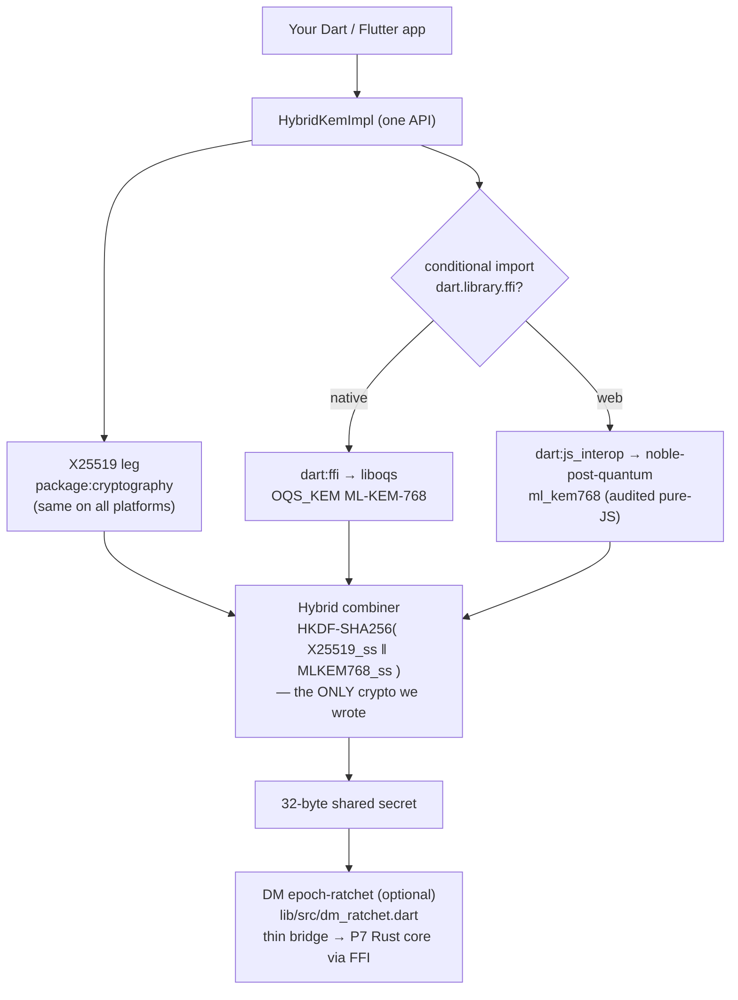

# sk_pqc

[](https://pub.dev/packages/sk_pqc)
[](https://pub.dev/packages/sk_pqc/score)
[](LICENSE)

```bash
dart pub add sk_pqc      # or:  flutter pub add sk_pqc
```

> ⚠️ **Experimental · pre-1.0 · NOT independently security-audited.** A clean-room
> **reference implementation** — tested and cross-impl-parity-verified against our Python
> (`sk-pqc`) and Rust (`sk-pqc`) builds, but with **no third-party security audit,
> fuzzing, or formal review**. It binds vetted libraries (`liboqs`/ML-KEM,
> `package:cryptography`, `@noble/post-quantum` on web); the original code is the wiring.
> **Review it yourself before production use.**

**sk_pqc is a Dart/Flutter library for hybrid post-quantum key encapsulation
(KEM).** It lets a Dart or Flutter app establish a shared secret that stays
secret even against a future quantum computer, by combining classical
**X25519** with NIST's **ML-KEM-768** (FIPS 203). One API works on **web and
native**. Use it to key DMs, files, or sessions with a post-quantum-resistant
handshake.

Keywords: post-quantum cryptography, ML-KEM / Kyber, hybrid KEM, X25519,
FIPS 203, Dart, Flutter, quantum-resistant key exchange, PQC.

Suite id: **`x25519-mlkem768`** (the same construction as TLS `X25519MLKEM768`
and Signal PQXDH).

```dart
import 'package:sk_pqc/sk_pqc.dart';

final kem = HybridKemImpl();                 // backend auto-selected (web/native)
final keys = await kem.generateKeyPair();    // publish keys.publicKey
final enc  = await kem.encapsulate(keys.publicKey);   // enc.ciphertext, enc.sharedSecret
final ss   = await kem.decapsulate(enc.ciphertext, keys.privateKey); // == enc.sharedSecret
// use the 32-byte ss as an AES-256-GCM / ChaCha20 key
```

---

## Quickstart

**Hybrid KEM** — establish a shared secret (confidential if EITHER X25519 OR
ML-KEM-768 holds):

```dart
import 'package:sk_pqc/sk_pqc.dart';

final kem = HybridKemImpl();                  // backend auto-selected (web/native)
final recipient = await kem.generateKeyPair();        // publish recipient.publicKey
final enc = await kem.encapsulate(recipient.publicKey); // enc.ciphertext + enc.sharedSecret
final ss  = await kem.decapsulate(enc.ciphertext, recipient.privateKey);
assert(ss.toString() == enc.sharedSecret.toString());   // same 32-byte secret
```

**1:1 DM epoch-ratchet bridge** — distribute one epoch secret over the hybrid KEM,
then key many messages off it symmetrically (the ~1.1 KB ML-KEM ciphertext is paid
once per epoch, not per message):

```dart
import 'package:sk_pqc/sk_pqc.dart';

final bob = await kem.generateKeyPair();
final e0  = newEpochSecret();
final bobE0 = await unwrapDmEpochSecret(
    await wrapDmEpochSecret(e0, bob.publicKey), bob.privateKey);

final alice = DmRatchet(epoch: 0, epochSecret: e0);
final bobR  = DmRatchet(epoch: 0, epochSecret: bobE0);

final (idx, key) = await alice.nextOutboundKey();   // carry idx on the wire
final recvKey = await bobR.messageKey(index: idx);  // index-addressable → reorder-tolerant
assert(key.toString() == recvKey.toString());
```

### Runnable examples

The [`example/`](example/) directory has self-contained programs (each `assert`s
its own correctness):

| File | What it shows |
|---|---|
| [`example/sk_pqc_example.dart`](example/sk_pqc_example.dart) | Hybrid KEM encap/decap roundtrip. |
| [`example/dm_ratchet_bridge_example.dart`](example/dm_ratchet_bridge_example.dart) | Hybrid KEM **+** the DM-ratchet bridge two-party roundtrip (per-epoch KEM wrap, symmetric per-message AES-256-GCM, out-of-order delivery, post-compromise rekey). |

```bash
LD_LIBRARY_PATH=$HOME/.local/lib SK_PQC_LIBOQS=$HOME/.local/lib/liboqs.so \
  dart run example/dm_ratchet_bridge_example.dart
```

---

## Architecture

One Dart API (`HybridKem`) fans out to two audited ML-KEM backends chosen at
compile time by conditional import. The X25519 leg and the HKDF combiner are the
same `package:cryptography` code on every platform — only the ML-KEM-768 leg
changes between web and native. Full diagrams + source map:
[`docs/ARCHITECTURE.md`](docs/ARCHITECTURE.md).



> **Browser vs native — the honest PQC caveat.** There is **no post-quantum KEM
> in any browser's WebCrypto** as of 2026, and a pure-Dart ML-KEM compiled to
> JS would not be a vetted implementation. So on **web** the ML-KEM-768 leg is
> provided by the audited JavaScript library
> [`@noble/post-quantum`](https://github.com/paulmillr/noble-post-quantum),
> which you must supply to the page (see [Backends](#backends)); on **native**
> it is [liboqs](https://github.com/open-quantum-safe/liboqs) over `dart:ffi`,
> which you must build/bundle per platform. **The classical X25519 leg is
> identical everywhere**, so even a misconfigured PQ backend degrades to
> classical X25519 security rather than failing open — but you do not get the
> post-quantum guarantee on a platform whose ML-KEM backend is missing. Verify
> your backend is wired (the API throws `SkPqcError`, never silently downgrades).

---

## Honest claims (read this)

- This is a **hybrid** KEM. The derived secret is **secure if *either* X25519
  *or* ML-KEM-768 holds** — breaking the post-quantum part alone falls back to
  classical X25519 security, and a quantum break of X25519 alone still leaves
  ML-KEM-768. We never replace classical crypto with PQ; we combine them.
- It targets the **FIPS 203 ML-KEM-768** tier (the internet default). It is
  **not** the CNSA-2.0 ceiling (that would be ML-KEM-1024).
- It is **KEM-only**. Signatures (ML-DSA / SLH-DSA) are **future work** — this
  package does not authenticate anything by itself. Pair it with a signature
  scheme for authenticated key exchange.
- The **web** backend's assurance depends on
  [`@noble/post-quantum`](https://github.com/paulmillr/noble-post-quantum)
  (audited pure-JS); the **native** backend's assurance depends on
  [liboqs](https://github.com/open-quantum-safe/liboqs).
- This is **not** "quantum-proof," "unbreakable," or "quantum-safe." Lattice
  cryptography is young. The defensible words are **"post-quantum"** /
  **"quantum-resistant."**

---

## The only crypto we wrote: the hybrid combiner

We never implement the lattice or curve primitives. The **single** piece of
original cryptographic code is the combiner, a standard KDF construction:

```
shared_secret = HKDF-SHA256( IKM = X25519_ss ‖ MLKEM768_ss,   // X25519 first
                             salt, info, L = 32 )
```

- `‖` is byte concatenation, **X25519 part first**.
- `salt` defaults to empty (RFC 5869 treats this as `HashLen` zero bytes).
- `info` defaults to `sk_pqc/x25519-mlkem768/v1`. Pass a context label
  (e.g. a channel id) for domain separation.
- **Concatenate-then-KDF. Never XOR. Never pure-PQ.**

HKDF itself is provided by `package:cryptography` (RFC 5869) and is verified in
tests against RFC 5869 §A.1 known answers.

---

## Wire format — the interop contract

All keys and the ciphertext are the **byte concatenation of the X25519 part
followed by the ML-KEM-768 part**. These lengths are fixed and MUST NOT change.

| Element | Layout | Bytes |
|---|---|---|
| **public key** | `X25519_pub (32)` ‖ `MLKEM768_pub (1184)` | **1216** |
| **private key** | `X25519_priv_seed (32)` ‖ `MLKEM768_secret (2400)` | **2432** |
| **ciphertext** | `X25519_ephemeral_pub (32)` ‖ `MLKEM768_ct (1088)` | **1120** |
| **shared secret** | `HKDF-SHA256(...)` (above) | **32** |

Details that pin interop exactly:

- **X25519 as a KEM** uses ephemeral-static Diffie–Hellman (DHKEM, as in HPKE /
  TLS): the encapsulator generates a fresh ephemeral X25519 keypair, computes
  `ss = DH(eph_priv, peer_static_pub)`, and ships the **ephemeral public key** as
  the 32-byte X25519 "ciphertext." The X25519 **private key is the raw 32-byte
  scalar seed** (as accepted by `X25519PrivateKey.from_private_bytes` in pyca and
  `newKeyPairFromSeed` in `package:cryptography`).
- **ML-KEM-768** is exactly FIPS 203: `pk 1184`, `sk 2400`, `ct 1088`, `ss 32`.
  Decapsulation uses **implicit rejection** — a corrupt ML-KEM ciphertext does
  **not** error; it yields a pseudo-random shared secret that simply won't match.

A machine-readable vector lives at
[`test_vectors/hybrid_kem_x25519_mlkem768.json`](test_vectors/hybrid_kem_x25519_mlkem768.json):
given the `hybrid.private_key` and `hybrid.ciphertext`, every conformant
implementation MUST recover `hybrid.shared_secret`. It is verified by **Dart
(native + web libs), liboqs, noble-post-quantum, and Python**. The ML-KEM-768 leg
keypair is derived from the **NIST ACVP FIPS 203 keyGen** seed (`d ‖ z`, tcId 26)
so it is anchored to an official known-answer.

### Python interop (forward-looking)

`tool/verify_vector.py` re-derives the shared secret from the vector using pyca
X25519 + liboqs-python + HKDF-SHA256 and asserts it equals the recorded value.
This is the exact contract the SK `pqkem.py` (PQC-MIGRATION Q1) must satisfy so
Dart↔Python vectors agree:

```bash
python3 tool/verify_vector.py
# derived shared : f11627140207d95e0b743245f5c6381e08c30dc61cc84abf03a822c888ce21fc
# MATCH: True
```

---

## Backends

One API, two backends selected by conditional import
(`if (dart.library.ffi) … else if (dart.library.js_interop) …`):

### Native (`dart:ffi` → liboqs)

The ML-KEM-768 leg binds [liboqs](https://github.com/open-quantum-safe/liboqs)'
`OQS_KEM` API (`OQS_KEM_new("ML-KEM-768")` → `keypair`/`encaps`/`decaps`). X25519
is `package:cryptography`.

You must provide the **liboqs shared library** at runtime. Lookup order: the
`SK_PQC_LIBOQS` env path, then platform default names (`liboqs.so`,
`liboqs.so.N`, `liboqs.dylib`, `oqs.dll`), then `~/.local/lib`, `/usr/local/lib`,
`/usr/lib`.

Build it (proven on Linux desktop here with liboqs 0.14.0):

```bash
git clone --branch 0.14.0 https://github.com/open-quantum-safe/liboqs
cmake -GNinja -DBUILD_SHARED_LIBS=ON -DOQS_BUILD_ONLY_LIB=ON \
      -DCMAKE_INSTALL_PREFIX=$HOME/.local -S liboqs -B liboqs/build
ninja -C liboqs/build install
export SK_PQC_LIBOQS=$HOME/.local/lib/liboqs.so
```

**Per-platform binary bundling (CI follow-up).** v1 proves the FFI path on Linux
desktop. Shipping to Android/iOS/macOS/Windows means building `liboqs` per ABI
and bundling it as a platform asset — the #1 runtime failure is a missing binary.
Plan:

| Platform | liboqs artifact | Bundling |
|---|---|---|
| Linux desktop | `liboqs.so` | system lib / app dir (done) |
| Android | `liboqs.so` per ABI (arm64-v8a, armeabi-v7a, x86_64) | `jniLibs/` via Gradle / a Flutter plugin |
| iOS / macOS | `liboqs.a`/`.dylib` (arm64, x86_64) | XCFramework in a CocoaPods/SwiftPM plugin |
| Windows | `oqs.dll` (x64, arm64) | bundled next to the executable |

Wrap this as a Flutter FFI plugin so the build system fetches/builds the right
binary per target (a GitHub Actions matrix building liboqs for each ABI).

### Web (`dart:js_interop` → noble-post-quantum)

The ML-KEM-768 leg binds
[`@noble/post-quantum`](https://github.com/paulmillr/noble-post-quantum)'s
`ml_kem768` (audited pure-JS); X25519 is `package:cryptography`. WebCrypto has
**no** PQC API in any browser (2026), so app-layer ML-KEM must come from JS.

Provide the JS dep by exposing `globalThis.skPqc` before your app loads. A ready
bootstrap is shipped at [`web/sk_pqc_noble_bootstrap.js`](web/sk_pqc_noble_bootstrap.js).
Three delivery options:

1. **Bundle** it with esbuild/rollup and add a `<script type="module">` to
   `web/index.html` (recommended — pin the audited version).
2. **CDN / import-map** to esm.sh or jsdelivr.
3. **Vendor** the bundle as a web asset.

```js
import { ml_kem768 } from '@noble/post-quantum/ml-kem.js';
globalThis.skPqc = {
  keygen()            { const k = ml_kem768.keygen();
                        return { publicKey: k.publicKey, secretKey: k.secretKey }; },
  encapsulate(pk)     { const e = ml_kem768.encapsulate(pk);
                        return { cipherText: e.cipherText, sharedSecret: e.sharedSecret }; },
  decapsulate(ct, sk) { return ml_kem768.decapsulate(ct, sk); },
};
```

---

## DM epoch-ratchet (`lib/src/dm_ratchet.dart`) — a thin bridge

On top of the one-shot KEM, this package ships the **key schedule** for SKChat's
1:1 DM epoch-ratchet (Level 3): a per-conversation **epoch secret** is
distributed once per epoch over the hybrid KEM, and per-message AES-256 keys are
derived symmetrically and index-addressably (loss/reorder tolerant). Periodic
rekey (50 messages **or** 7 days) starts a fresh independent epoch — forward
secrecy across the boundary, post-compromise security within.

```dart
// Per-message key (matches Python skchat.dm_ratchet + the Rust sk-pqc byte-for-byte):
final mk = await deriveDmMessageKey(epochSecret, epoch, index);

// Distribute an epoch secret over the hybrid KEM (once per epoch, not per message):
final secret  = newEpochSecret();
final payload = await wrapDmEpochSecret(secret, peerHybridPublicKey); // ct‖nonce‖wrapped
final got     = await unwrapDmEpochSecret(payload, myHybridPrivateKey);
```

The HKDF labels are fixed and shared across implementations:

```text
salt = "skchat/dm-epoch/"          ‖ u64_be(epoch)
info = "skchat/dm-ratchet/msg/v1/" ‖ u64_be(index)
key  = HKDF-SHA256(IKM = epoch_secret, salt, info, L = 32)
```

> **HONESTY — this layer is a BRIDGE, not its permanent home.** The long-term
> plan (P7) is for this ratchet key schedule to live **once** in the shared
> **Rust core** (`sk-pqc/src/ratchet.rs`) and be reached from Dart over **FFI**
> — exactly like the ML-KEM-768 leg already reaches liboqs — instead of a
> permanent hand-maintained Dart copy. Three parallel implementations (Python,
> Rust, Dart) of a security-critical schedule can silently drift, so this Dart
> code is deliberately **thin, clearly marked, and pinned to the same
> cross-language KAT vectors** as Python and Rust. When the Rust core exposes an
> FFI surface, these functions should collapse into a shim over it and the
> original Dart crypto here should be deleted. The only original code here is
> label/IKM wiring around vetted primitives (HKDF-SHA256, AES-256-GCM, and the
> existing hybrid KEM) — no primitive is hand-rolled.

---

## Testing

```bash
dart pub get

# combiner KATs run anywhere. Native FFI + cross-backend tests need liboqs
# (and, for cross-backend, node + @noble/post-quantum); they skip cleanly if
# absent.
LD_LIBRARY_PATH=$HOME/.local/lib \
SK_PQC_LIBOQS=$HOME/.local/lib/liboqs.so \
SK_PQC_NOBLE_DIR=/path/to/noble \
dart test
```

What's covered:

- **Combiner vectors** — HKDF-SHA256 against RFC 5869 §A.1 and hand-computed
  values, plus salt/info domain-separation and wrong-length rejection.
- **ML-KEM-768 KAT** — decapsulating the FIPS 203 / NIST ACVP-anchored vector
  yields the standard shared secret.
- **Cross-backend** — a keypair/encapsulation from the web lib (noble)
  decapsulates under the native lib (liboqs) and vice-versa; both decapsulate the
  shared interop vector identically.
- **Round-trips + property** — generate → encapsulate → decapsulate; two
  encapsulations to the same key differ.
- **Failure cases** — malformed keys/ciphertext throw `SkPqcError` (never crash);
  tampered ML-KEM ciphertext triggers implicit rejection (mismatched secret).
- **DM ratchet** — `deriveDmMessageKey` against cross-language KAT vectors
  (Python/Rust agree byte-for-byte), determinism/index/epoch separation,
  outbound-counter + rekey policy, and wrap/unwrap epoch-secret round-trip over
  the hybrid KEM (incl. tamper rejection).

---

## Status

| Path | State |
|---|---|
| Hybrid combiner (HKDF-SHA256) | ✅ tested vs RFC 5869 + vectors |
| Native FFI (liboqs) ML-KEM-768 | ✅ runs on Linux desktop |
| Web (noble) ML-KEM-768 | ✅ compiles under dart2js; cross-checked vs liboqs |
| Cross-impl vector (Dart/liboqs/noble/Python) | ✅ all agree |
| DM epoch-ratchet key schedule (Dart bridge) | ✅ KAT-matched to Python + Rust |
| DM ratchet → shared Rust core via FFI (P7) | ⏳ planned (delete Dart copy then) |
| Per-arch native binaries (Android/iOS/mac/Win) | ⏳ CI follow-up |
| Signatures (ML-DSA / SLH-DSA) | ❌ out of scope (future) |

## License

Apache-2.0. See [LICENSE](LICENSE).

## Related projects / See also
- 📖 **Architecture:** [`docs/ARCHITECTURE.md`](docs/ARCHITECTURE.md) — mermaid data-flow (web noble / native liboqs backends + KEM/ratchet) + source map.
- ↔️ **Siblings (same suite, all import as `sk_pqc`):** PyPI [`sk-pqc`](https://pypi.org/project/sk-pqc/) ([sk-pqc-py](https://github.com/smilinTux/sk-pqc-py)) · crates.io [`sk-pqc`](https://crates.io/crates/sk-pqc) ([sk-pqc-rs](https://github.com/smilinTux/sk-pqc-rs)).
- ⬇️ **Used by:** [skchat](https://github.com/smilinTux/skchat) / [skcomms](https://github.com/smilinTux/skcomms) — hybrid post-quantum DMs in the app + envelope/DM KEM.
- 🔏 **Companion:** [sk_pgp](https://github.com/smilinTux/sk_pgp) — the Python OpenPGP-PQC signing engine (the PGPy replacement).
- 📐 **Standards:** [sk-standards](https://github.com/smilinTux/sk-standards) — crypto · data-flow · version · doc/SOP.
